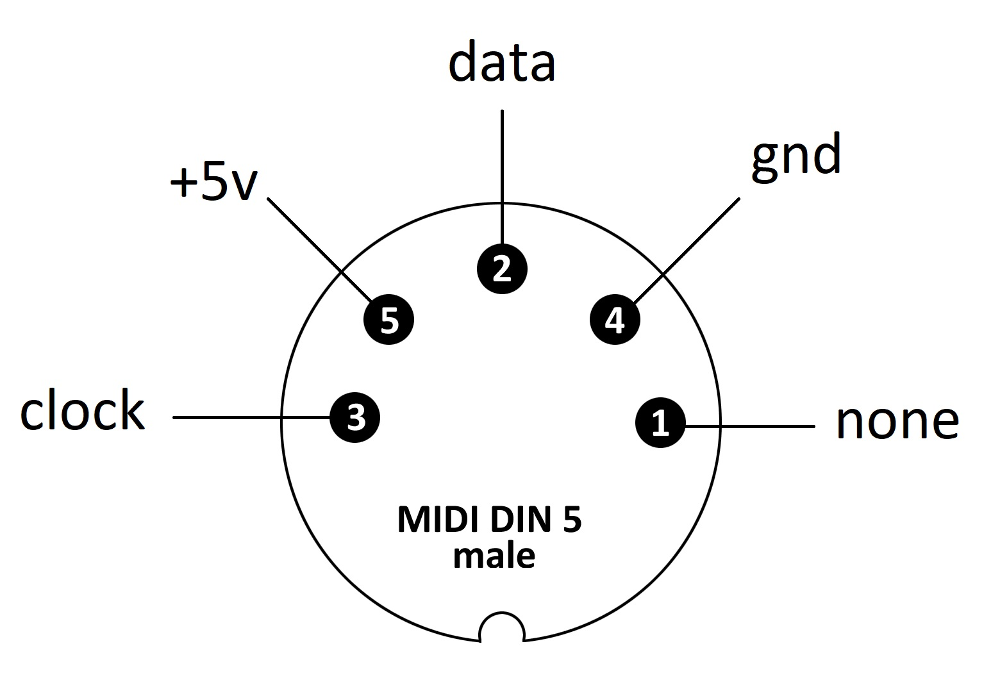
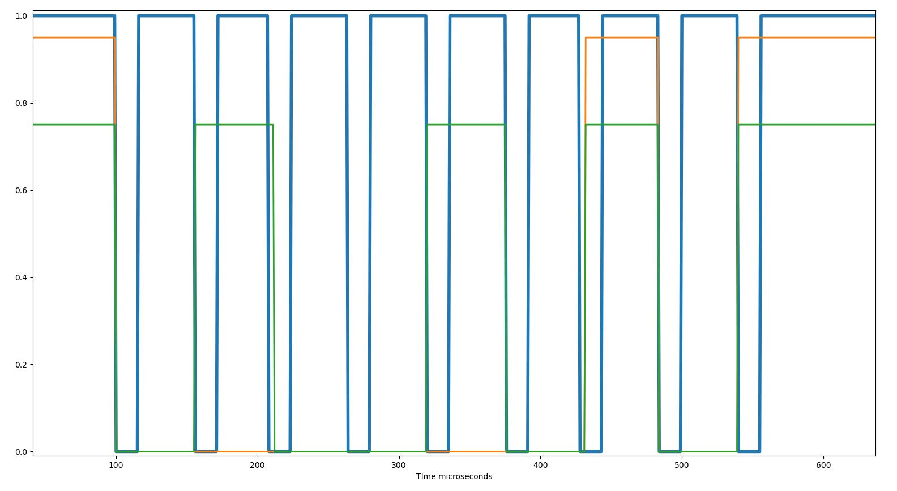
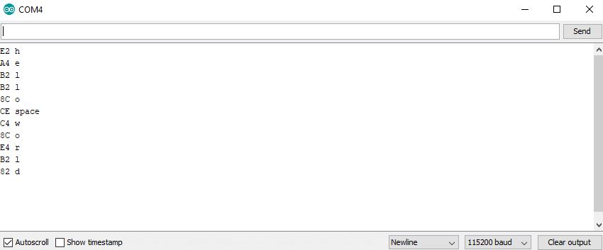

# Mazovia Keyboard Driver

Created in 2020, updated in 2026 Arduino driver for the **MERA-REFA KL-13**, a vintage Polish PC XT keyboard from the 1980s, compatible with Mazovia 1016.

The keyboard uses a proprietary serial protocol, not PS/2 or USB. Clock and data lines were captured with a two-channel logic analyzer. Timing was analyzed to identify byte boundaries, and a driver was written from scratch. 83 keys decoded.

## Wiring

The keyboard connector is a DIN-5. Only 4 pins are used:

| Keyboard | Arduino |
|---|---|
| Pin 2 - Data  | D2 |
| Pin 3 - Clock | D3 |
| Pin 4 - GND   | GND |
| Pin 5 - VCC   | +5V |

<p>
  
</p>

## Protocol

Each keypress produces a frame of 18 clock pulses. The first 8 bits contain the key code. Bit 9 is a separator. Then the same 8-bit key code is sent again, followed by another separator. `keyboard.ino` uses only the first 8 bits.

```text
Frame: [ b7 b6 b5 b4 b3 b2 b1 b0 | P ] - gap - [ b7 b6 b5 b4 b3 b2 b1 b0 | P ]
         ------ key code ---------           ---------- repeat ----------
```

<p>
  
</p>

## Files

| File | Description |
|---|---|
| `keyboard.ino` | Main driver. Timer and interrupt based. Reads 8-bit key code and translates it to a key name through a lookup table. |
| `xt_driver.ino` | Experimental approach based on XT scan codes. Uses CHANGE interrupt and detects press/release via MSB `0x80`. |

## Usage

```text
1. Wire keyboard to Arduino per table above
2. Flash keyboard.ino
3. Open Serial Monitor at 115200 baud
4. Press any key. Hex code and key name will appear.
```

<p>
  
</p>


## Dependencies

- [MsTimer2](https://playground.arduino.cc/Main/MsTimer2/) for the 300 ms timeout trigger in `keyboard.ino`

## References

- [log_analyzer](https://github.com/DenisSouth/log_analyzer), logic analyzer tool used to capture the signal
- [XT keyboard scan codes](https://www.win.tue.nl/~aeb/linux/kbd/scancodes-1.html)
- [XtKeyboard adapter reference](https://git.dejvino.cz/dejvino/xt-keyboard-adapter)